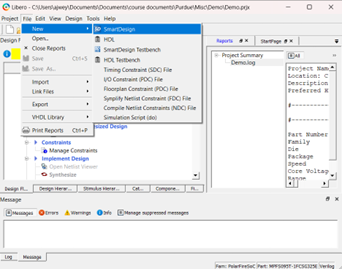
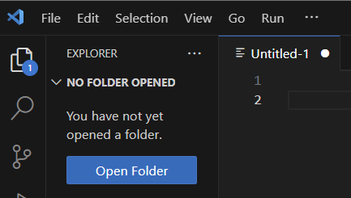
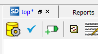
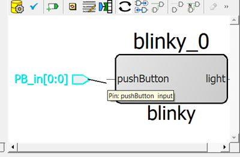
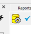
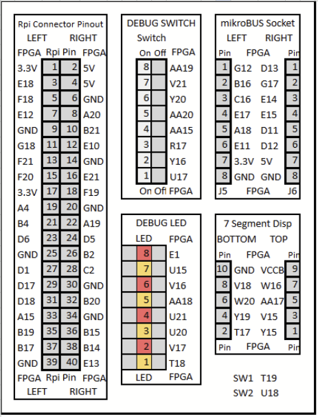

# Using Libero on Windows for Microchip Discovery Kit
## Creating a project
1. Go to "Project > New Project" and choose a name and file location


2. Select the device as shown below
   - Family: `PolarFireSoC`
   - Die: `MPFS095T`
   - Part Number: `MPFS095T-1FCSG325E`


3. At "Device Settings" page, use the defaults and click "Next"

4. "Add HDL Sources" will allow you to start the project with existing HDL source files, but HDL source files can also be added later. For now, "Add HDL Sources" can be skipped.

5. We will not use "Add Constraints" during project creation.

## Making a SmartDesign
A SmartDesign is a graphical representation of the top-level module.

6. Select "File > New > SmartDesign"



7. Name your SmartDesign.

8. Right-click your SmartDesign and click "Set as Root"


## Adding source files to the SmartDesign
9. Open the folder "project_name > hdl" in Visual Studio Code (Lookup how to install VSCode if not already installed)




10. In Visual Studio Code, make a .sv file in the "hdl" folder by right clicking


Here is a sample SV file to test:
```
module blinky( //a module is kind of like a function in other coding languages. This module's name is "blinky"

input logic pushButton, //input logic for input signals (pushButton is the variable (wire) name)
output logic light //output logic for input signals (light is the variable (wire) name)

); //End of port definitions (inputs/outputs)

assign light = pushButton; //this connects the input variable to the output variable
                           //with a physical wire, hence the term "Hardware Description Language"

endmodule //End of the blinky module
```


11. In Libero, click "Build Hierarchy" for Libero to recognize the new source file.
    - Libero will only recognize source files that have modules, meaning that the .sv file must have "module...endmodule"


12. Access the SmartDesign by double clicking it in the "Design Hierarchy" tab


13. In the SmartDesign, drag the module "blinky" onto the workspace to see its ports.


14. Additional source files can be added to the folder and dragged onto the workspace.

## Adding top-level input/output ports in the SmartDesign
15. Right-click the workspace and select "Add Port"



16. Specify input/output and the bit depth ([N-1:0] for N bits)


17. You can drag to connect a port.




## Synthesis
18. In your SmartDesign, click the "Generate Component" icon (looks like a yellow barrel)



19. Under the "Design Flow" tab, double-click "Synthesize" (under "Implement Design")


## Pin Assignment
20. Under the "Design Flow" tab, double-click "Manage Constraints" (under "Constraints")


21. Under "I/O Attributes" click "Edit > Edit with I/O Editor"


22. Assign each "Pin Number" as shown below (also available in the excel sheet)




23. In the top left, click the blue commit icon.


24. Close the I/O editor

## Place and Route
25. Under the "Design Flow" tab, double-click "Place and Route" (under "Implement Design")


 
## Flash to the FPGA
26. Connect your PC to the FPGA using a USB-C cable

27. Under the "Design Flow" tab, scroll down and double-click "Run PROGRAM Action" (under "Program Design")


28. Wait for the FPGA to flash. Once it is done, the left-most LED should turn off when you press push button 1! It is on by default because the buttons are active-low, meaning a logical 0 is represented by a button press and logical 1 by default. Now you are ready to implement more complicated designs!
